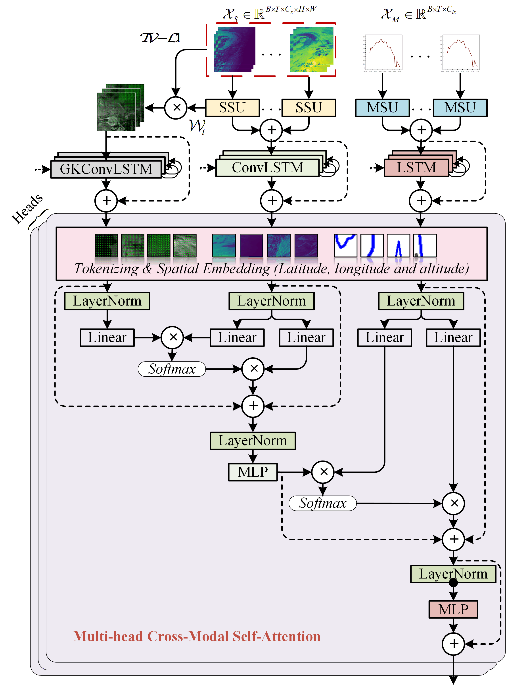

<div align="center">

# **SolarFusionNet: Enhanced Solar Radiation Forecasting via Automated Multi-Modal Feature Selection and Cross-Modal Fusion**
[](https://github.com/pre-commit/pre-commit)
[](https://pytorch.org/get-started/locally/)
[](https://pytorchlightning.ai/)
[](https://hydra.cc/) 
[](#license)
</div>

## Description

This is the official repository to the paper ["SolarFusionNet: Enhanced Solar Irradiance Forecasting via Automated Multi-Modal Feature Selection and Cross-Modal Fusion"](https://ieeexplore.ieee.org/document/10723760). In this research work, our study introduces SolarFusionNet, a novel deep learning architecture that effectively integrates automatic multi-modal feature selection and crossmodal data fusion. SolarFusionNet utilizes two distinct types of automatic variable feature selection units to extract relevant features from multichannel satellite images and multivariate meteorological data, respectively. Long-term dependencies are then captured using three types of recurrent layers, each tailored to the corresponding data modal. In particular, a novel Gaussian kernel-injected convolutional long short-term memory network is specifically designed to isolate the sparse features present in the cloud motion field derived from optical flow. Subsequently, a hierarchical multi-head cross-modal self-attention mechanism is proposed based on the physical-logical dependencies among the three modalities to investigate the coupling correlations among the modalities. The experimental results indicate that SolarFusionNet exhibits robust performance in predicting regional solar irradiance, achieving higher accuracy than other state-of-the-art models and a forecast skill ranging from 37.4% to 47.6% against the smart persistence model for the 4-hour-ahead forecast.
<div align="center">

</div>

## Dataset

### Satellite
The link to download the satellite data is [EUMETSAT](https://console.cloud.google.com/marketplace/product/bigquery-public-data/eumetsat-seviri-rss?hl=en-GB&project=triple-shadow-397515). Select the RSS dataset. Then use "reproject.py" in the scripts to cut the region, you need to set up the yaml file in configs before cutting. 

### Meteorological data
BSRN data can be downloaded by referring to the [Solar data](https://github.com/dazhiyang/SolarData) provided by Prof. Yang, or by directly visiting the [BSRN official website](https://bsrn.awi.de/). Don't forget to perform quality control.


## Training process
The pytorch modules required for the model must be installed before starting to train the model, detailed versions can be found in [requirements.txt](requirements.txt). After the requirements for model training have been met, all the files in configs need to be configured.


## Installation

#### Pip
```bash
# clone project
https://github.com/JOTYtao/Solar_Fusionformer.git
# create conda environment
conda create -n Solar_Fusionformer python=3.9
conda activate Solar_Fusionformer
# install requirements
pip install -r requirements.txt
```
## Baselines

The following baseline models are included:

-  **Autoformer** - Autoformer: Decomposition Transformers with Auto-Correlation for Long-Term Series Forecasting [[NeurIPS 2021]](https://arxiv.org/abs/2106.13008)
-  **FEDformer** - FEDformer: Frequency Enhanced Decomposed Transformer for Long-term Series Forecasting [[ICML 2022]](https://arxiv.org/abs/2201.12740) 
-  **TFT** - Temporal Fusion Transformers for interpretable multi-horizon time series forecasting [[International Journal of Forecasting]](https://www.sciencedirect.com/science/article/pii/S0169207021000637)
-  **CrossViViT** - Improving day-ahead Solar Irradiance Time Series Forecasting by Leveraging Spatio-Temporal Context[[NeurIPS 2023]](https://arxiv.org/abs/2306.01112)


## Citation

Please cite the following, if you find this work useful in your research:

```
@ARTICLE{10723760,
  author={Jing, Tao and Chen, Shanlin and Navarro-Alarcon, David and Chu, Yinghao and Li, Mengying},
  journal={IEEE Transactions on Sustainable Energy}, 
  title={SolarFusionNet: Enhanced Solar Irradiance Forecasting via Automated Multi-Modal Feature Selection and Cross-Modal Fusion}, 
  year={2024},
  volume={},
  number={},
  pages={1-13},
  keywords={Feature extraction;Satellite images;Forecasting;Optical flow;Solar irradiance;Predictive models;Data models;Deep learning;Accuracy;Correlation;Solar irradiance forecasting;Multi-modal deep learning;Attention mechanism;Optical flow},
  doi={10.1109/TSTE.2024.3482360}}
```

## Acknowledgement

This codebase is built on <a href="https://github.com/gitbooo/CrossViVit.git">CrossViViT</a>

## License

SolarFusionNet is licensed under the MIT License.

```
MIT License

Copyright (c) 2024 JOTYtao

Permission is hereby granted, free of charge, to any person obtaining a copy
of this software and associated documentation files (the "Software"), to deal
in the Software without restriction, including without limitation the rights
to use, copy, modify, merge, publish, distribute, sublicense, and/or sell
copies of the Software, and to permit persons to whom the Software is
furnished to do so, subject to the following conditions:

The above copyright notice and this permission notice shall be included in all
copies or substantial portions of the Software.

THE SOFTWARE IS PROVIDED "AS IS", WITHOUT WARRANTY OF ANY KIND, EXPRESS OR
IMPLIED, INCLUDING BUT NOT LIMITED TO THE WARRANTIES OF MERCHANTABILITY,
FITNESS FOR A PARTICULAR PURPOSE AND NONINFRINGEMENT. IN NO EVENT SHALL THE
AUTHORS OR COPYRIGHT HOLDERS BE LIABLE FOR ANY CLAIM, DAMAGES OR OTHER
LIABILITY, WHETHER IN AN ACTION OF CONTRACT, TORT OR OTHERWISE, ARISING FROM,
OUT OF OR IN CONNECTION WITH THE SOFTWARE OR THE USE OR OTHER DEALINGS IN THE
SOFTWARE.
```
